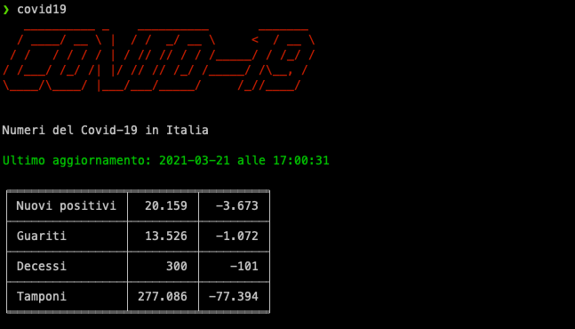

# COVID-19 CLI for Italy
Simple CLI to get latest covid19 Italy stats in your terminal

## Table of Contents

- [Installation](#installation)
- [Usage](#usage)
- [Support](#support)
- [Contributing](#contributing)

## Installation
[TBD]

## Usage
[TBD]

## Support

Please [open an issue](https://github.com/mantovanig/covid19-cli/issues/new) for support.

## Contributing

Please contribute using [Github Flow](https://guides.github.com/introduction/flow/). Create a branch, add commits, and [open a pull request](https://github.com/mantovanig/covid19-cli/compare/).